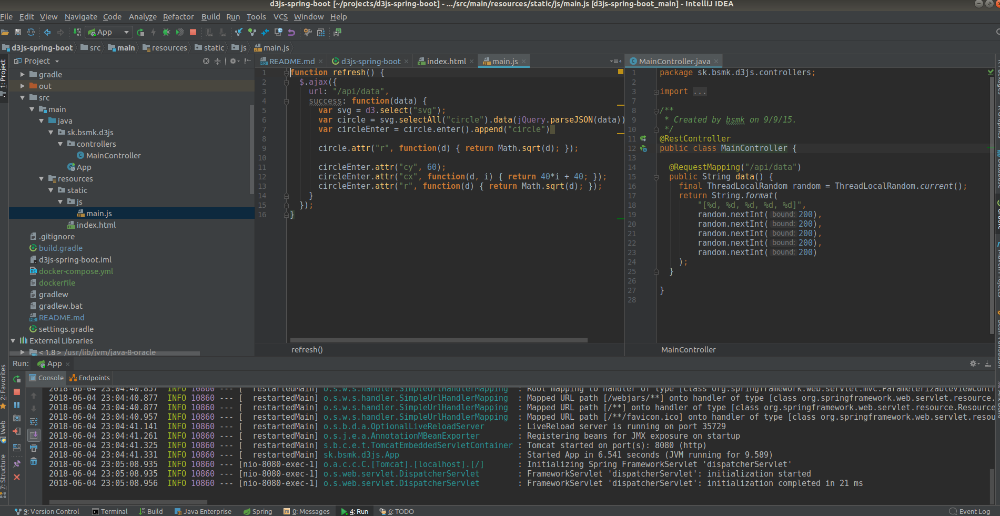

# d3js-spring-boot
d3js playground

Project created with "Spring Boot" for the D3.js visualitzations.

### Create container and deploy
```
docker-compose up -d
```

This action create the container from image with Open JAVA 1.8 and Gradle 4.5, and run server (jar) in port 80

Requeriments:

* Docker
* Docker-compose


### Development

Run:
```
gradle bootRun
```

Requeriments:

* Java sdk 1.8
* Gradle 4.0 or +


